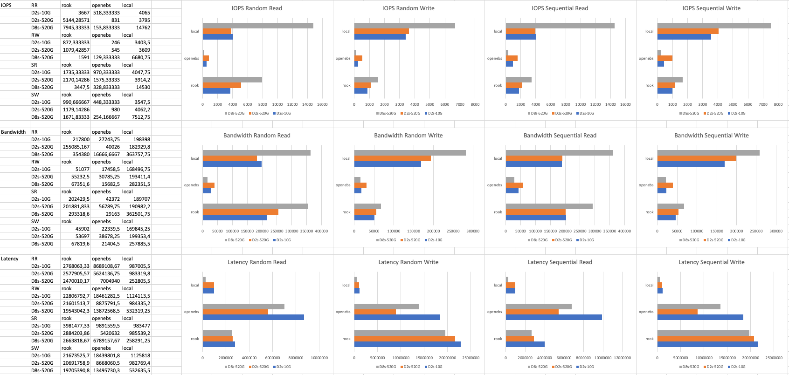

# Overview

This repo tests two persistence mechanisms for kubernetes in various configurations. Tested solutions are:

- [Rook with Ceph](https://github.com/rook/rook)
- [OpenEBS with Jiva](https://github.com/openebs/jiva)

If you want to run it yourselves please refer to section [Config parameters](#config-parameters).

If you want to see detailed results summarized from runs performed in scope of this research please refer
to [Performance tests results](./performance-tests-results.md) file.

# Results Summary

Results are compared to "local" kubernetes volume created directly on data disk without distribution.

Each test was repeated 3-7 times. Before final calculations, most deviated results were removed.

We can observe:

- (obviously) Local volume has the best performance in almost every aspect.
- Rook Ceph is better than OpenEBS Jiva in almost all tests.
- OpenEBS Jiva is better than Rook Ceph only in latency of write operations. Reason for this wasn't investigated but
  might be that "write first, then replicate" approach is used by Jiva which would be very dangerous. It's hard to find
  other explanation for such results only in this one aspect.
- Rook Ceph has amazing performance for random read. When Bandwidth is compared it's even better than local drive in
  some configurations. Reason for this wasn't investigated but might be that Ceph is using parallel read in some cases.
- OpenEBS has extremely low results on machines with more CPUs. Reason for this wasn't investigated, but it looks very
  suspicious.
- In almost all cases influence of disk sizes is clearly visible. Reason for this is that Azure is limiting disks
  performance accordingly to disk size - bigger disk, more IOPS it will have.
- In most cases influence of more CPUs is visible (as mentioned before OpenEBS Jiva acts weirdly)
- (not visible in presented data) During tests it was observed that OpenEBS Jiva, when PVC was created, is: a) creating
  multiple local volumes on nodes, b) starts replication process between those wolves, c) provides PV. That means that
  PV provisioning takes significant amount of time, while Rook Ceph provides PV almost immediately after PVC is created.

Presented observations show that from two compared solutions Rook Ceph is clear winner. Both solutions install without
any problems and installation takes similar time, it wasn't measured though. Stability of results was slightly better in
Rook Ceph as well.

When comparing Rook Ceph to local disk performance its quite obvious that write operations would be always slower due to
replication step. What is interesting is very good performance results of Rook Ceph on read operations. That would lead
to more architectural conclusions:

- For write intensive loads when replication is not crucial (i.e., temporary computation files) it might be considered
  to use local volumes instead of replicated ones.
- For relatively stable but read intensive data it should be advised to use Rook Ceph replicated volumes.

# Config parameters

Create [config.mk](./config.mk) file in root directory with fields described
in [config.mk.template](./config.mk.template) file.

To create service principal required to provide values to [config.mk](./config.mk) file have a
look [here](https://www.terraform.io/docs/providers/azurerm/guides/service_principal_client_secret.html). In short:

- run `az account list` and find your subscription
- run `az account set --subscription="SUBSCRIPTION_ID"`
- run `az ad sp create-for-rbac --role="Contributor" --scopes="/subscriptions/SUBSCRIPTION_ID" --name="SOME_NAME"`

From output of first and last commands you should have all values required for [config.mk](./config.mk) file.  
